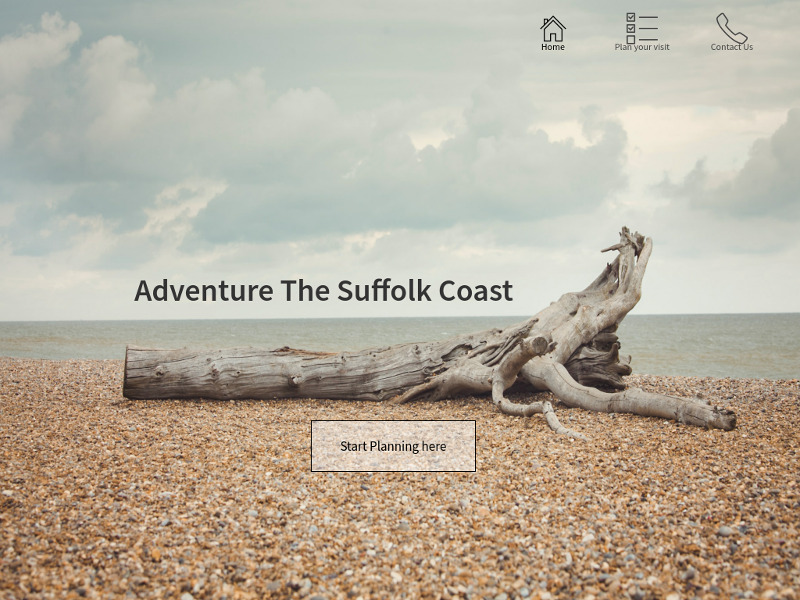
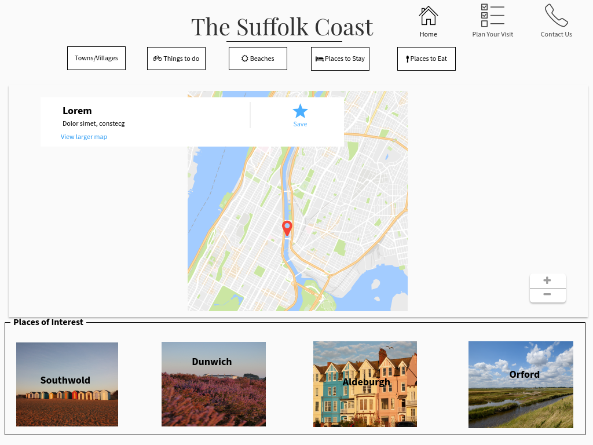
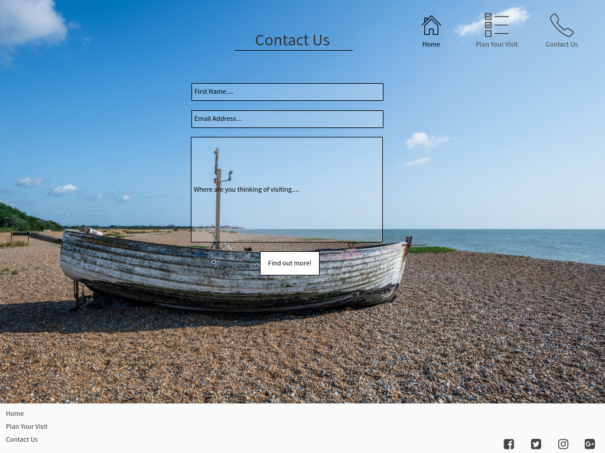

# Visit The Suffolk Coast
Visit the Suffolk coast is a site which aims to give the user more information about their potential visit to the Suffolk Coast.
This website hopes to entise new travelers into the idea of expoloring this beautiful part of the United Kingdom. We aim to give helpful information about the area, so that it can be explored properly.
The languages which are used on this project are HTML5, CSS3 and JavaScript. Bootstrap has also been used alongside these languages to help the project has a clear structure and is also responsive depending on the screen size the user is using.

## UX
This website is designed with the notion of giving people who may not have thought about travelling to Suffolk and really taking in what this county has to offer. 
The aim of this site is to be concise and helpful towards the user, easy to navigate as well as looking easy on the eye. 

### User Stories
* User Goals:
  * As a user, I want to be able navigate around the site easily, comfortably and safely.
  * As a user, I would like to be able to contact the site for any extra information that I may need, ask any questions. When I ask send the question off, I would like a response to say message recieved.
  * As a user, I am looking at this site to learn about the Suffolk Coast and where it is located. I also want to know of places to stay and eat, things to do and any places of interest.
  * As a user, I want to the links to take me to the places that I am interested in.
  * As a user, I really would like to find out more information on the attractions found on the Suffolk Coast.
  * As a user, I would like to feel comfortable and secure in making a decision to visit the Suffolk Coast.

* How the site assists the user in meeting their goals:
  * By having an attractive website that is clean and easy to navigate with the use of a navbar. This will allow the user to click onto the page they need, also on the navbar is the website title which is also a link to the home page.
  * The contact form within the contact us page is simple and easy for the user to use without getting confused. There is clear parameters that the user needs to enter, on completion there is a modal to pop up saying that the request has been complete.
  * Within the footer there is links to the Home, Plan Your Visit and Contact Us page. There is also social media links for the user to use if they would like to see more from this website. 

### Wireframes
The Wireframes for this project were created on WireframePro. I spent a good amount of time moving around the content to see what will work the best for the look and feel of the website. The images of my wireframes are below.

### Design
The colours that I have chosen for this project are to help the user feel at ease and to not be to in your face. The colours have also been chosen to reflect the Suffolk Coast natural colours.
I have been aiming to showcase some of the colours that the user may see and feel if they were to ever visit the Suffolk coast.

The colours I used were: 
* #f9f9f9 - Snow was used for the background
* #041414 - Dark Green has been used for the text
* #00A3A3 - Persian Green has been used for the buttons

The main colour used for the background colours, navbar and footer is called Snow and this has been used to keep consistency and to also reflect how the Suffolk Coast sky looks like. I also choose this colour as it has given the site a subtle but classy colour scheme as well as allowing the text to be easily read.
The navbar has a default colour set to Snow, but for the purpose of the images on the landing page and contact us page those navbars are transparent. This is so that the user can see the image within that page clearly.  
